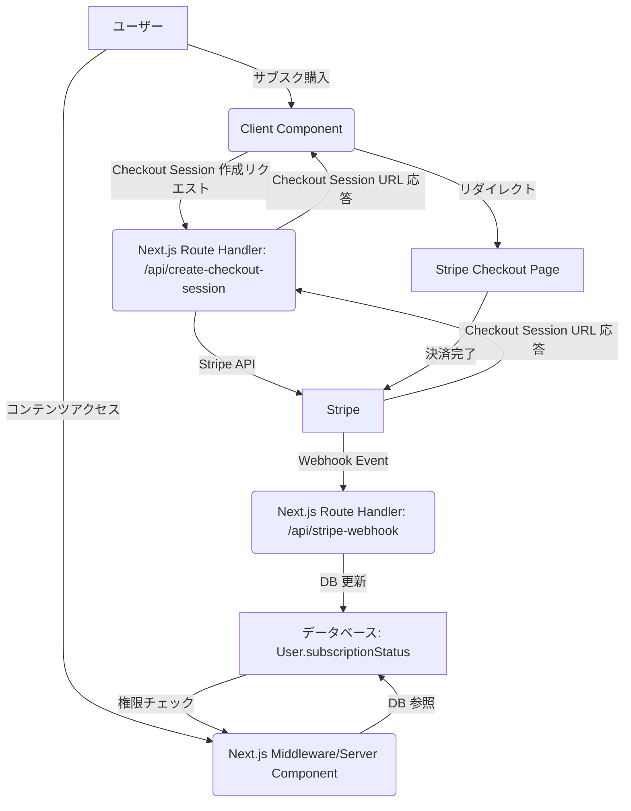

# Next.js × Stripeでサブスク課金を実装する：Webhookと権限管理の実践

Next.js App Router 環境で、Stripe を利用したサブスクリプション課金を導入しようとしている中級Webエンジニアの皆さんへ。本記事では、Stripe のサブスクリプション機能を Next.js の App Router 環境にどのように統合し、堅牢な権限管理システムを構築するかについて、具体的な実装例と運用上の注意点を交えて解説します。

---

## 1. 概要

本記事では、Next.js 15系およびApp Router環境でStripeのサブスクリプション機能を実装するための実践的なアプローチを深掘りします。特に以下の点に焦点を当てます。

1.  **Next.js App Router と Stripe の連携**: Checkout Session の作成とリダイレクト。
2.  **Webhook を用いた契約状態の同期**: なぜ Webhook が唯一の正であり、安全な状態管理に不可欠なのか。
3.  **アプリケーションレベルでの権限制御**: `free`, `active`, `past_due`, `canceled` などのサブスクリプション状態に基づいたアクセス制御の実装方法。
4.  **実装時の落とし穴と運用上の注意点**: セキュリティ、冪等性、API キー管理など。

## 2. 前提知識

本記事を最大限に活用するために、以下の知識があることを前提とします。

*   **Next.js App Router**: `app` ディレクトリ構造、Server Components, Client Components, Route Handlers の基本的な理解。
*   **TypeScript**: 型安全なコード記述の経験。
*   **Stripe の基本**: Stripe アカウントのセットアップ、Product と Price の概念。
*   **データベース**: Prisma を利用した ORM の基本的な操作。
*   **API の基礎**: RESTful API、HTTP メソッド、JSON の理解。

## 3. アーキテクチャ設計

Stripe サブスクリプションと Next.js アプリケーションの統合は、以下のフローで動作します。

1.  **クライアントサイド (Next.js Client Component)**: ユーザーがサブスクリプション購入ボタンをクリック。
2.  **サーバーサイド (Next.js Route Handler)**: クライアントからのリクエストを受け、Stripe Checkout Session を作成。そのセッション URL をクライアントに返す。
3.  **クライアントサイド (Next.js Client Component)**: 受け取った URL にリダイレクトし、Stripe Checkout ページへ遷移。
4.  **Stripe Checkout**: ユーザーが決済を完了。
5.  **Stripe Webhook**: 決済完了やサブスクリプションの状態変化（更新、キャンセル、支払い失敗など）が発生すると、Stripe からアプリケーションの Webhook エンドポイントへイベントが送信される。
6.  **アプリケーションサーバー (Next.js Route Handler)**: Webhook イベントを受信し、署名を検証後、データベース上のユーザーのサブスクリプション状態を更新する。
7.  **アプリケーションロジック (Next.js Server Component/Route Handler/Middleware)**: データベースのサブスクリプション状態に基づいて、ユーザーへのコンテンツアクセスを制御する。

このアーキテクチャの鍵は、**Stripe Webhook を通じてのみサブスクリプション状態を更新する**点です。クライアントからのリクエストは詐称やネットワークエラーの可能性があるため、信頼できません。



## 4. 実装手順

### 4.1. データベーススキーマの定義 (Prisma)

ユーザーのサブスクリプション状態を管理するためのシンプルなデータベーススキーマを定義します。

```typescript
// prisma/schema.prisma
enum SubscriptionStatus {
  FREE // 未購読、または無料で利用中
  ACTIVE // 購読中
  PAST_DUE // 支払い期限切れ（Grace Period中など）
  CANCELED // キャンセル済み、期間終了まで有効
  INACTIVE // 完全に期限切れ
}

model User {
  id                String             @id @default(cuid())
  email             String             @unique
  name              String?
  stripeCustomerId  String?            @unique // Stripeの顧客ID
  stripeSubscriptionId String?          @unique // StripeのサブスクリプションID
  subscriptionStatus SubscriptionStatus @default(FREE)
  currentPeriodEnd  DateTime? // サブスクリプション期間の終了日
  createdAt         DateTime           @default(now())
  updatedAt         DateTime           @updatedAt
}
```

`SubscriptionStatus` には、`FREE`, `ACTIVE`, `PAST_DUE`, `CANCELED`, `INACTIVE` といった状態を定義し、Stripe のイベントに応じてこれらの状態を更新します。

### 4.2. Stripe Checkout Session の作成 (Route Handler)

ユーザーがサブスクリプションを購入する際に、Stripe Checkout ページへ誘導するためのセッションを作成します。`app/api/create-checkout-session/route.ts` に Route Handler を作成します。

```typescript
// app/api/create-checkout-session/route.ts
import { NextResponse } from 'next/server';
import Stripe from 'stripe';
import { getServerAuthSession } from '@/lib/auth'; // 認証セッション取得のヘルパー関数
import { db } from '@/lib/db'; // Prisma Client

const stripe = new Stripe(process.env.STRIPE_SECRET_KEY!, {
  apiVersion: '2024-06-20', // 執筆時点の最新APIバージョン
});

export async function POST(req: Request) {
  try {
    const session = await getServerAuthSession();
    if (!session?.user?.id) {
      return new NextResponse('Unauthorized', { status: 401 });
    }

    const { priceId } = await req.json(); // クライアントから価格IDを受け取る

    // アプリケーションユーザーの取得
    const user = await db.user.findUnique({
      where: { id: session.user.id },
    });

    if (!user) {
      return new NextResponse('User not found', { status: 404 });
    }

    let customerId = user.stripeCustomerId;

    // Stripe Customer ID がない場合は新規作成
    if (!customerId) {
      const customer = await stripe.customers.create({
        email: user.email,
        name: user.name || undefined,
        metadata: { userId: user.id },
      });
      customerId = customer.id;

      // DBに顧客IDを保存
      await db.user.update({
        where: { id: user.id },
        data: { stripeCustomerId: customerId },
      });
    }

    // Stripe Checkout Session の作成
    const stripeSession = await stripe.checkout.sessions.create({
      customer: customerId,
      payment_method_types: ['card'],
      line_items: [{
        price: priceId, // Stripeで定義した価格ID
        quantity: 1,
      }],
      mode: 'subscription',
      success_url: `${process.env.NEXT_PUBLIC_APP_URL}/dashboard?session_id={CHECKOUT_SESSION_ID}`,
      cancel_url: `${process.env.NEXT_PUBLIC_APP_URL}/pricing`,
      metadata: { userId: user.id }, // Webhookで利用するためにユーザーIDを渡す
    });

    return NextResponse.json({ url: stripeSession.url });

  } catch (error) {
    console.error('[STRIPE_CHECKOUT_ERROR]', error);
    return new NextResponse('Internal Server Error', { status: 500 });
  }
}
```

この Route Handler は、認証済みのユーザーに対して Stripe Checkout Session を作成し、その URL をクライアントに返します。既存の `stripeCustomerId` がない場合は新規作成し、DB に保存します。`priceId` は Stripe で事前に設定した価格 ID を利用します。`metadata` に `userId` を含めることで、Webhook イベントでユーザーを特定しやすくなります。

### 4.3. Stripe Webhook の受信と処理 (Route Handler)

Stripe から送信される Webhook イベントを受信し、ユーザーのサブスクリプション状態を更新します。セキュリティのため、**必ず署名検証を行います**。`app/api/stripe-webhook/route.ts` に Route Handler を作成します。

```typescript
// app/api/stripe-webhook/route.ts
import { NextRequest, NextResponse } from 'next/server';
import Stripe from 'stripe';
import { db } from '@/lib/db';
import { SubscriptionStatus } from '@prisma/client'; // Prismaで定義したEnum

const stripe = new Stripe(process.env.STRIPE_SECRET_KEY!, {
  apiVersion: '2024-06-20',
});

export async function POST(req: NextRequest) {
  const rawBody = await req.text();
  const sig = req.headers.get('stripe-signature');

  if (!sig) {
    return new NextResponse('Missing stripe-signature header', { status: 400 });
  }

  let event: Stripe.Event;

  // Webhookの署名検証
  try {
    event = stripe.webhooks.constructEvent(
      rawBody,
      sig,
      process.env.STRIPE_WEBHOOK_SECRET!
    );
  } catch (err: any) {
    console.error(`⚠️ Webhook Error: ${err.message}`);
    return new NextResponse(`Webhook Error: ${err.message}`, { status: 400 });
  }

  // イベントタイプに基づいて処理
  try {
    switch (event.type) {
      case 'checkout.session.completed':
        const checkoutSession = event.data.object as Stripe.CheckoutSession;

        if (checkoutSession.mode !== 'subscription') {
          break; // サブスクリプション以外のセッションはスキップ
        }

        // 支払い済みサブスクリプションの取得
        const subscriptionId = checkoutSession.subscription as string;
        const subscription = await stripe.subscriptions.retrieve(subscriptionId);
        const customerId = checkoutSession.customer as string;
        const userId = checkoutSession.metadata?.userId; // Checkout Session作成時に渡したuserId

        if (!userId) {
          console.error('User ID not found in metadata for checkout.session.completed');
          return new NextResponse('User ID not found', { status: 400 });
        }

        await db.user.update({
          where: { id: userId },
          data: {
            stripeCustomerId: customerId,
            stripeSubscriptionId: subscription.id,
            subscriptionStatus: SubscriptionStatus.ACTIVE,
            currentPeriodEnd: new Date(subscription.current_period_end * 1000),
          },
        });
        break;

      case 'customer.subscription.updated':
        const updatedSubscription = event.data.object as Stripe.Subscription;
        const customerSubscription = await db.user.findFirst({
          where: { stripeSubscriptionId: updatedSubscription.id },
        });

        if (!customerSubscription) {
          console.error('Subscription not found in DB for customer.subscription.updated');
          return new NextResponse('Subscription not found', { status: 404 });
        }

        // StripeのサブスクリプションステータスをPrismaのEnumにマッピング
        let status: SubscriptionStatus;
        switch (updatedSubscription.status) {
          case 'active':
            status = SubscriptionStatus.ACTIVE;
            break;
          case 'past_due':
            status = SubscriptionStatus.PAST_DUE;
            break;
          case 'canceled': // 期間終了後にCANCELEDになる
            status = SubscriptionStatus.CANCELED;
            break;
          case 'unpaid':
            status = SubscriptionStatus.INACTIVE; // またはCANCELED
            break;
          case 'incomplete':
          case 'incomplete_expired':
          case 'paused':
            status = SubscriptionStatus.INACTIVE;
            break;
          default:
            status = SubscriptionStatus.INACTIVE; // その他の未知のステータス
        }

        await db.user.update({
          where: { id: customerSubscription.id },
          data: {
            stripeSubscriptionId: updatedSubscription.id,
            subscriptionStatus: status,
            currentPeriodEnd: new Date(updatedSubscription.current_period_end * 1000),
          },
        });
        break;

      case 'customer.subscription.deleted':
        const deletedSubscription = event.data.object as Stripe.Subscription;
        const userWithDeletedSub = await db.user.findFirst({
          where: { stripeSubscriptionId: deletedSubscription.id },
        });

        if (userWithDeletedSub) {
          await db.user.update({
            where: { id: userWithDeletedSub.id },
            data: {
              subscriptionStatus: SubscriptionStatus.INACTIVE,
              stripeSubscriptionId: null, // サブスクリプションIDをクリア
              currentPeriodEnd: null,
            },
          });
        }
        break;

      // その他、必要に応じてstripe.invoice.payment_failedなども処理
      default:
        console.warn(`Unhandled event type ${event.type}`);
    }
  } catch (error) {
    console.error('[WEBHOOK_HANDLER_ERROR]', error);
    return new NextResponse('Webhook Handler Error', { status: 500 });
  }

  // Stripeに対して成功を通知
  return new NextResponse('Received', { status: 200 });
}
```

この Webhook ハンドラでは、`req.text()` を使用してリクエストの raw body を取得し、Stripe の署名検証を行います。検証が成功したら、イベントタイプに応じてデータベースの `User` モデルを更新します。特に `checkout.session.completed` と `customer.subscription.updated` イベントが重要です。

**冪等性 (Idempotency) について**: Stripe Webhook は、ネットワークの問題などで同じイベントが複数回送信される可能性があります。そのため、イベント処理ロジックは冪等である必要があります。上記の例では、`db.user.update` が常に最新の状態をセットするため、ある程度冪等性が保たれますが、複雑なビジネスロジックを伴う場合は、`Stripe.Event.id` をデータベースに保存し、既に処理済みでないかを確認するなどの追加の対策を検討してください。

### 4.4. 権限制御の実装

ユーザーのサブスクリプション状態に基づいてコンテンツへのアクセスを制御します。Next.js App Router では、主にミドルウェアまたはサーバーコンポーネントでのサーバーサイドガードが適切です。

#### 4.4.1. Next.js Middleware を利用したルート保護

`middleware.ts` ファイルで、特定のパスへのアクセスをサブスクリプション状態に基づいて制限できます。

```typescript
// middleware.ts
import { NextResponse } from 'next/server';
import type { NextRequest } from 'next/server';
import { getServerAuthSession } from '@/lib/auth'; // 認証セッション取得のヘルパー関数
import { db } from '@/lib/db';
import { SubscriptionStatus } from '@prisma/client';

export async function middleware(req: NextRequest) {
  const session = await getServerAuthSession(); // 認証セッションを取得 (NextAuth.jsなど)
  const pathname = req.nextUrl.pathname;

  // 認証が必須なページ (例: /dashboard, /settings)
  if (pathname.startsWith('/dashboard') || pathname.startsWith('/settings')) {
    if (!session?.user?.id) {
      // 未認証の場合、ログインページへリダイレクト
      return NextResponse.redirect(new URL('/api/auth/signin', req.url));
    }

    // 注意: MiddlewareはEdge Runtimeで動作するため、標準のPrisma Clientは使用できません。
    // Prisma Accelerate等のEdge対応ドライバを使用するか、以下のDBチェック処理を
    // Server Component側で行う必要があります。
    const user = await db.user.findUnique({
      where: { id: session.user.id },
    });

    // ユーザーが存在しない、またはサブスクリプションが有効でない場合
    if (!user || user.subscriptionStatus !== SubscriptionStatus.ACTIVE) {
      // 課金情報ページなど、サブスクリプションの管理を促すページへリダイレクト
      return NextResponse.redirect(new URL('/pricing', req.url));
    }
  }

  // それ以外のパスは通常通り
  return NextResponse.next();
}

export const config = {
  matcher: ['/dashboard/:path*', '/settings/:path*'], // 保護したいパスを指定
};
```

Middleware はエッジで実行されるため高速ですが、データベースアクセスがボトルネックになる可能性があります。頻繁にアクセスされるルートや複雑なチェックが必要な場合は、Server Components でのガードを検討してください。

#### 4.4.2. Server Components でのサーバーサイドガード

各 Server Component の内部で、ユーザーのサブスクリプション状態をチェックし、アクセスを制御します。

```typescript
// app/dashboard/page.tsx
import { getServerAuthSession } from '@/lib/auth';
import { db } from '@/lib/db';
import { SubscriptionStatus } from '@prisma/client';
import { redirect } from 'next/navigation';

export default async function DashboardPage() {
  const session = await getServerAuthSession();

  if (!session?.user?.id) {
    redirect('/api/auth/signin');
  }

  const user = await db.user.findUnique({
    where: { id: session.user.id },
  });

  if (!user || user.subscriptionStatus !== SubscriptionStatus.ACTIVE) {
    redirect('/pricing'); // サブスクリプションがないか、ACTIVEでない場合はリダイレクト
  }

  // ここから購読者向けのコンテンツ
  return (
    <div>
      <h1>Welcome to your Premium Dashboard!</h1>
      <p>This content is only available to active subscribers.</p>
      {/* ... プレミアムコンテンツ ... */}
    </div>
  );
}
```

このアプローチは、よりきめ細やかな制御が可能であり、コンポーネントごとに異なるロジックを適用できます。

## 5. ハマりどころ（注意点）

### 5.1. Webhook 署名検証は必須

Stripe Webhook エンドポイントは公開されているため、悪意のある第三者によって偽のイベントが送信される可能性があります。`stripe.webhooks.constructEvent` を使用した署名検証を**必ず**行い、Stripe からの正規のイベントのみを処理するようにしてください。署名検証に失敗したイベントは即座に 400 Bad Request で拒否すべきです。

### 5.2. 冪等性の実装

Stripe Webhook イベントは、ネットワークの問題やリトライメカニズムにより、同じイベントが複数回送信される可能性があります。イベントハンドラは、同じイベントを複数回処理してもアプリケーションの状態が一貫しているように、冪等に設計する必要があります。`event.id` をデータベースに保存し、既に処理済みかどうかをチェックするなどの方法があります。

### 5.3. クライアントサイドの状態を信用しない

クライアントサイドから送信される支払い完了やサブスクリプション状態に関する情報は、ユーザーが改ざんできるため、**絶対に信用してはいけません**。決済が成功したかどうか、ユーザーがどのプランに加入しているか、といった決定的な情報はすべて Stripe Webhook を通じてサーバーサイドで更新されたデータベースの状態を正とすべきです。

### 5.4. 価格 ID の直書き管理と環境変数

上記の例では `priceId` をクライアントから受け取っていますが、これも直書きでコード内に含めるのはセキュリティ上推奨されません。理想的には、Stripe の Product/Price ID は環境変数で管理するか、安全なサーバーサイドから取得するようにしてください。複数のプランがある場合は、データベースにプラン情報を持ち、それに対応する Stripe Price ID を紐づけるのが一般的です。

### 5.5. Stripe API キーの安全な管理

`STRIPE_SECRET_KEY` や `STRIPE_WEBHOOK_SECRET` は、環境変数として管理し、Git リポジトリにコミットしないようにしてください。本番環境では、キーを保護するために適切なシークレット管理サービス（例: Vercel の環境変数、AWS Secrets Manager、Google Secret Manager）を利用してください。

### 5.6. エラーハンドリングとリトライ戦略

Webhook 処理中にエラーが発生した場合、Stripe は自動的にイベントの再送信を試みます。アプリケーション側では、エラーログを適切に残し、必要に応じてアラートを送信するなどの監視体制を整えることが重要です。また、データベースの一時的な接続不良などに対応できるよう、リトライメカニズムを考慮することも有効です。

## 6. まとめ

Next.js App Router で Stripe サブスクリプションを実装する際は、Stripe Checkout と Webhook を中心とした堅牢なアーキテクチャ設計が不可欠です。

*   Checkout Session の作成は Route Handler で行い、ユーザーを Stripe にリダイレクトします。
*   Stripe Webhook を唯一の真実として扱い、サブスクリプションの状態をデータベースで同期します。Webhook 署名検証は必須です。
*   ユーザーのサブスクリプション状態（`FREE`, `ACTIVE`, `PAST_DUE`, `CANCELED` など）をデータベースに保存し、これに基づいてアプリケーションの権限制御を行います。Next.js Middleware や Server Components を活用してアクセス制限を実装できます。
*   クライアントサイドの情報を信用せず、Stripe API キーの安全な管理、冪等性の確保など、セキュリティと運用上の注意点を十分に考慮してください。

これらの実践的なアプローチにより、安全で信頼性の高いサブスクリプション機能を Next.js アプリケーションに組み込むことができます。

---

## 参考リンク

*   **Stripe 公式ドキュメント - サブスクリプション**: [https://stripe.com/docs/billing/subscriptions](https://stripe.com/docs/billing/subscriptions)
*   **Stripe 公式ドキュメント - Checkout**: [https://stripe.com/docs/payments/checkout](https://stripe.com/docs/payments/checkout)
*   **Stripe 公式ドキュメント - Webhooks**: [https://stripe.com/docs/webhooks](https://stripe.com/docs/webhooks)
*   **Next.js 公式ドキュメント - App Router**: [https://nextjs.org/docs/app](https://nextjs.org/docs/app)
*   **Next.js 公式ドキュメント - Route Handlers**: [https://nextjs.org/docs/app/building-your-application/routing/route-handlers](https://nextjs.org/docs/app/building-your-application/routing/route-handlers)
*   **Next.js 公式ドキュメント - Middleware**: [https://nextjs.org/docs/app/building-your-application/routing/middleware](https://nextjs.org/docs/app/building-your-application/routing/middleware)
